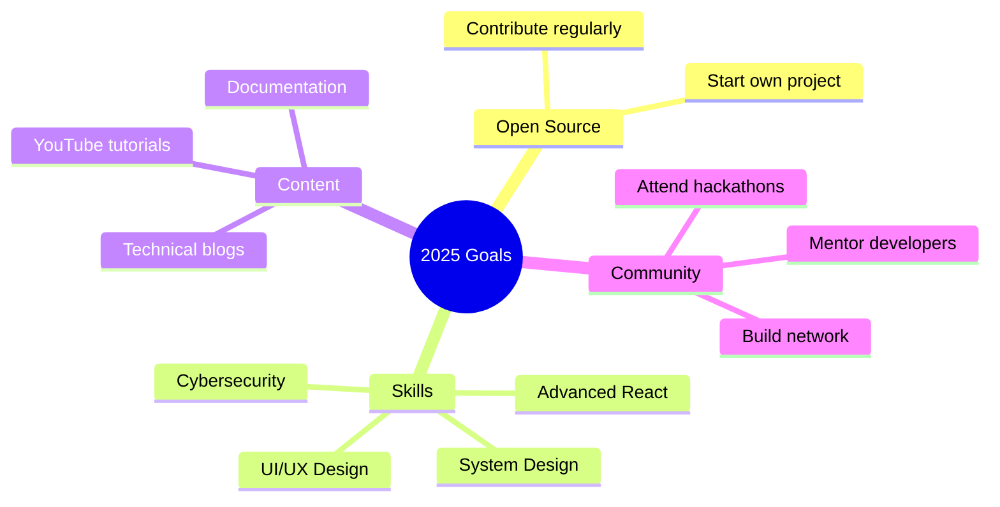

<div align="center">

# 👨‍💻 Rounak Jana


### Passionate about creating innovative solutions that make a difference


</div>

---

## 🙋‍♂️ About Me

```python
class Developer:
    def __init__(self):
        self.name = "Rounak Jana"
        self.role = "Frontend Developer"
        self.location = "India"
        self.languages = ["Python", "JavaScript", "SQL"]
        self.passions = ["Problem Solving", "UI/UX", "Gaming"]
    
    def say_hi(self):
        print("Thanks for dropping by! Let's build something amazing together.")

me = Developer()
me.say_hi()
```


### 🎯 Quick Facts

- 🔭 Currently working on **full-stack web applications**
- 🌱 Learning **Advanced React patterns & System Design**
- 🎮 Gaming enthusiast who draws UI/UX inspiration from games
- 📚 Constant learner exploring **Cybersecurity & Cloud**
- 💡 Believer in accessible technology for everyone
- 🤝 Open to collaborate on interesting projects

<br clear="right"/>

---

## 🛠️ Tech Arsenal

<div align="center">

### Languages & Frameworks
<table>
  <tr>
    <td align="center" width="96">
      
      <br>Python
    </td>
    <td align="center" width="96">
      
      <br>JavaScript
    </td>
    <td align="center" width="96">
      
      <br>Django
    </td>
    <td align="center" width="96">
      
      <br>Node.js
    </td>
    <td align="center" width="96">
      
      <br>HTML5
    </td>
    <td align="center" width="96">
      
      <br>CSS3
    </td>
  </tr>
</table>

### Databases & Tools
<table>
  <tr>
    <td align="center" width="96">
      
      <br>MySQL
    </td>
    <td align="center" width="96">
      
      <br>PostgreSQL
    </td>
    <td align="center" width="96">
      
      <br>Git
    </td>
    <td align="center" width="96">
      
      <br>VS Code
    </td>
    <td align="center" width="96">
      
      <br>GitHub
    </td>
    <td align="center" width="96">
      
      <br>Linux
    </td>
  </tr>
</table>

</div>

---

## 📈 GitHub Analytics

<div align="center">
  
  
</div>

<div align="center">
  
</div>

<div align="center">
  
</div>

---

## 🎯 Current Goals & Learning Path

<div align="center">



</div>

### 📚 Currently Learning

 **React Patterns** | **System Architecture** | **Cybersecurity** | **UI/UX Principles**

---

## 🏆 Achievements & Milestones

<div align="center">

| 🎯 Goal | 📊 Status | 🗓️ Timeline |
|---------|-----------|-------------|
| Open Source Contributions | 🟡 In Progress | Q1 2025 |
| Personal Portfolio | 🟢 Planning | Q2 2025 |
| Technical Blog Series | 🟡 Started | Ongoing |
| New Programming Language | 🔴 Planned | Q3 2025 |
| Mentor Developers | 🟢 Active | Ongoing |

</div>

---

## 💬 Let's Connect!

<div align="center">

[](mailto:rounakjana74@gmail.com)
[](https://www.linkedin.com/in/rounak-jana-4408aa257/)
[](https://x.com/RounakJana18)

### 📧 **rounakjana74@gmail.com**


</div>

---

## 💡 Favorite Quote

<div align="center">

```diff
+ "The best way to predict the future is to create it."
                                              - Peter Drucker
```

</div>

---

## 🎮 Fun Zone

<details>
<summary>🎯 <b>Click to see some fun facts!</b></summary>
<br>

- 🎮 **Gaming Inspiration**: I analyze game UIs to improve my design skills
- 🌙 **Night Owl**: My most productive coding hours are after midnight
- ☕ **Coffee Lover**: Powered by coffee and curiosity
- 🎵 **Music Coding**: Lo-fi beats are my coding companion
- 🧩 **Puzzle Solver**: Love coding challenges and brain teasers
- 🌍 **Tech for Good**: Passionate about accessible, inclusive technology

</details>

---

<div align="center">

### 📊 Profile Stats


### 🐍 Contribution Snake


---


### ⭐ **If you like my work, consider giving a star!**

**Made with ❤️ by [Rounak Jana](https://github.com/ronie-18)**


</div>
