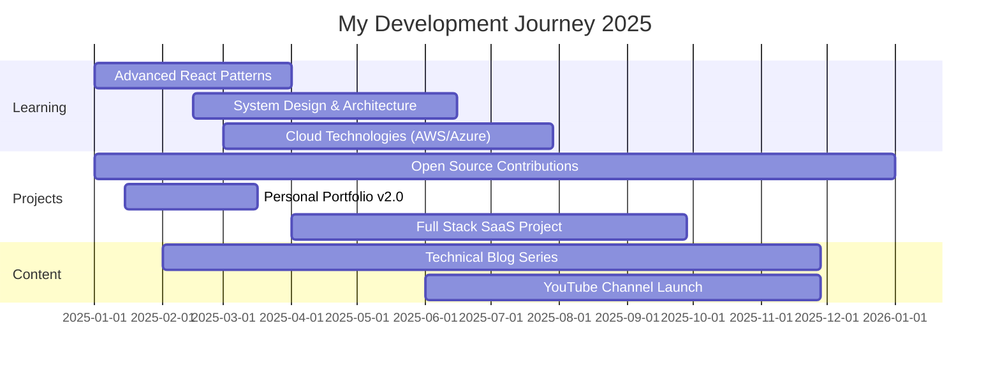

<h1 align="center">
  
</h1>

<div align="center">
  
  [](https://git.io/typing-svg)
  
  
  
</div>

## 🚀 Journey Overview

<table align="center">
<tr>
<td width="50%">

### 👨‍💻 About Me
```yaml
name: Rounak Jana
located_in: Kolkata, India
current_focus: 
  - Building scalable web apps
  - Exploring cloud architecture
  - Contributing to open source
education: Computer Science
interests:
  - Gaming & Game Design
  - Tech Blogs & Documentation
  - Competitive Programming
```

</td>
<td width="50%">

### 💼 Developer Stats


</td>
</tr>
</table>


## 🎨 Technology Palette

<div align="center">

### 🔥 Core Technologies

<table>
<tr>
<td align="center" width="150">

<br><b>Python</b>
</td>
<td align="center" width="150">

<br><b>Django</b>
</td>
<td align="center" width="150">

<br><b>JavaScript</b>
</td>
<td align="center" width="150">

<br><b>React</b>
</td>
<td align="center" width="150">

<br><b>MySQL</b>
</td>
</tr>
</table>

### 🛠️ Development Tools


### 🎯 Frontend Arsenal


### ⚙️ Backend & Database


</div>


## 📊 GitHub Insights

<div align="center">
  
  
</div>

<div align="center">
  
</div>

<div align="center">
  
</div>


## 🎯 2025 Roadmap

<div align="center">



</div>

### 🌱 Current Focus Areas

<table align="center">
<tr>
<td align="center" width="25%">

<br><b>React.js</b>
<br>Advanced Patterns
</td>
<td align="center" width="25%">

<br><b>System Design</b>
<br>Scalable Architecture
</td>
<td align="center" width="25%">

<br><b>Cloud Services</b>
<br>AWS & DevOps
</td>
<td align="center" width="25%">

<br><b>UI/UX Design</b>
<br>User-Centric Design
</td>
</tr>
</table>


## 🏆 Achievements & Highlights

<div align="center">

| 🎖️ Achievement | 📈 Progress | 🎯 Target | 📅 Status |
|:---:|:---:|:---:|:---:|
| **Open Source PRs** | 15 | 50 | 🟢 30% |
| **GitHub Stars** | 25 | 100 | 🟡 25% |
| **Blog Articles** | 3 | 20 | 🟠 15% |
| **Projects Completed** | 8 | 15 | 🟢 53% |
| **Coding Streak** | 47 days | 100 days | 🟢 47% |

</div>


## 📝 Latest Blog Posts

<div align="center">

<!-- BLOG-POST-LIST:START -->
📰 [Understanding Django ORM: A Deep Dive](https://medium.com/@rounakjana)  
📰 [Building RESTful APIs with Node.js & Express](https://dev.to/ronie18)  
📰 [CSS Grid vs Flexbox: When to Use What?](https://hashnode.com/@ronie18)  
📰 [JavaScript ES6+ Features You Should Know](https://medium.com/@rounakjana)  
<!-- BLOG-POST-LIST:END -->

➡️ [**Read More on My Blog**](https://medium.com/@rounakjana)

</div>


## 🌐 Connect With Me

<div align="center">

[](mailto:rounakjana74@gmail.com)
[](https://www.linkedin.com/in/rounak-jana-4408aa257/)
[](https://x.com/RounakJana18)
[](https://ronie-18.github.io)
[](https://medium.com/@rounakjana)
[](https://dev.to/ronie18)

### 📬 **rounakjana74@gmail.com**

</div>


## 🎮 Beyond Code

<details open>
<summary><b>🎯 Fun Facts & Interests</b></summary>
<br>

<table align="center">
<tr>
<td width="50%">

### 🎮 Gaming
- UI/UX inspiration from game designs
- Puzzle & strategy games enthusiast
- Level design analysis for web layouts

### 📚 Learning
- Daily coding challenges on LeetCode
- Tech documentation reader
- YouTube tutorial creator (soon!)

</td>
<td width="50%">

### ☕ Lifestyle
- Night owl developer (productivity peaks at midnight)
- Coffee-powered coding sessions
- Lo-fi beats companion

### 🌍 Philosophy
- Technology should be accessible to all
- Open source contributions matter
- Continuous learning is key

</td>
</tr>
</table>

</details>


## 💭 Quote of the Day

<div align="center">


</div>


## 📈 Activity Graph

<div align="center">
  
[](https://github.com/ashutosh00710/github-readme-activity-graph)

</div>


## 🐍 Contribution Snake

<div align="center">
  


</div>

---

<div align="center">

### 💖 Support My Work


[](https://github.com/ronie-18)
[](https://github.com/ronie-18)

<br>

**If you find my projects interesting, consider giving them a ⭐**

<br>


**Made with 💜 by Rounak Jana**

</div>
